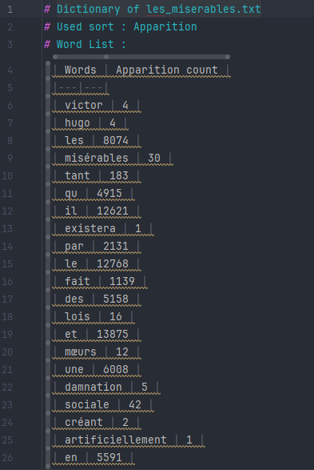

# Practical work 1

## Author
- Lisa Gorgerat
- Alex Berberat

## Table of content

- [Introduction](#introduction)
- [Application](#application)
    - [How to setup](#how-to-setup)
      - [Cloning our repository](#how-to-clone-our-repository)
      - [Build our application](#how-to-build-our-application)
    - [Demo](#demo)

## Introduction
This practical work running in java 21 is a picocli based CLI that take a text file in UTF8 format as an input and generate a dictionary file containing each word and the number of times they appear in the file.  

The generated dictionary is sorted in one of the four orders possible depending on the user input command.
- Apparition order  
  (Sort the words in the order they appear throughout the text file.)
- Alphabetical order
- Reverse alphabetical order
- Usage order  
  (Sort the words from the most used to the least used.)
 
We don't consider two words distinct if the only thing that change is the case of certain letters. Numbers aren't considered words, if they are in digit form.  

## Getting Started
### Prerequisites
- JDK
- Maven (optional, a maven wrapper comes with the project)

### Recommendation
Use Intellij IDEA because the whole project was built using it.

### Setup
#### Clone the repository

1. Go to the [repository](https://github.com/AlexB-HEIG/DAI-Practical-work-1) on github and choose your favorite clone option.
2. Open the terminal in the folder where you want to clone the repository.
3. Clone the repo.
    ```sh 
    git clone git@github.com:AlexB-HEIG/DAI-Practical-work-1.git
    ```
4. Change git remote url to avoid accidental pushes to base project.
    ```sh
    git remote set-url origin <github_username/repo_name>
    git remote -v
    ```

#### Build the application
To build the application, you can use the following commands in your terminal.
```sh
# Download the dependencies and their transitive dependencies
./mvnw dependency:go-offline

# Package the application
./mvnw package
```
Or you can use _Package application as JAR file_ configuration file to build easily in Intellij IDEA.  


## Usage
Once the app is built you can run it.

#### Run the application
To run the application in Intellij, we have created configuration files with every type of sort available and they all use the given example text file of the project in order to be able to run the app easily.  


You can also run the app directly from the terminal while being in the project root with one of the commands below :  
```sh
java -jar target/DAI-Practical-work-1-1.0-SNAPSHOT.jar <your file> -s <sort type> sort
# OR
java -jar target/DAI-Practical-work-1-1.0-SNAPSHOT.jar -s <sort type> <your file> sort
```

If you aren't sure, simply run the command :  
```sh
java -jar target/DAI-Practical-work-1-1.0-SNAPSHOT.jar
```
This will make the following CLI appear :
```sh
Usage: DAI-Practical-work-1-1.0-SNAPSHOT.jar [-hV] -s=<sort> <filename>
       [COMMAND]
CLI for dictionary creation from a text.
      <filename>      The name of the file.
  -h, --help          Show this help message and exit.
  -s, --sort=<sort>   The sort function to use (possible values ALPHABETICAL,
                        REVERSE_ALPHABETICAL, USAGE, APPARITION).
  -V, --version       Print version information and exit.
Commands:
  sort  Count and sort words from a file.
```


> [!IMPORTANT]
> 
> Remember to repackage the app after you have made modifications.


## Demonstration 
We have given a text file `les_miserables.txt` that you can find in the `example_files` folder on which you can test our application.  

After creating the app package as seen earlier. We run the desired command, for this demo we'll be using the sort by apparition option.  
The command : 
```sh
java -jar target/DAI-Practical-work-1-1.0-SNAPSHOT.jar -s APPARITION example_files/les_miserables.txt sort
```
We get this output in the terminal :
```sh
Sorting example_files/les_miserables.txt using APPARITION
Execution time in ms: 518
```

This generates a Mardkdown file named `<your file>.dictionary.md` that can be found at the same place as the text file you gave the app.  
For this demo the generated file is named `les_miserables.txt.dictionary.md` and can be found in the `example_files` folder.  


|By opening the file in any program that can read a basic text file, you will see this output:|If you open it in a program where you can visualize Markdown correctly, you will have this output:|
|---|---|
|  |  |

> [!NOTE]
> 
> Both pictures have been cropped to take less place and therefore don't represent the whole dictionary.
